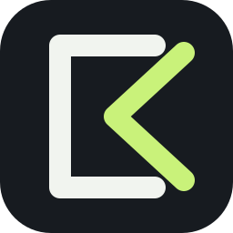
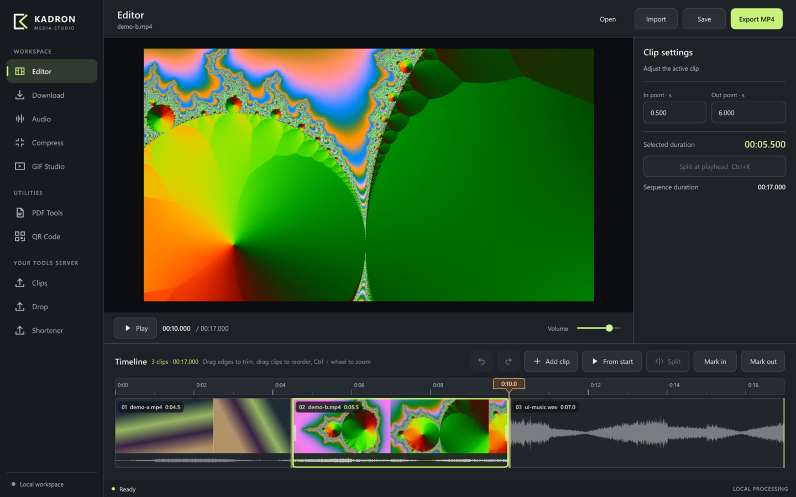
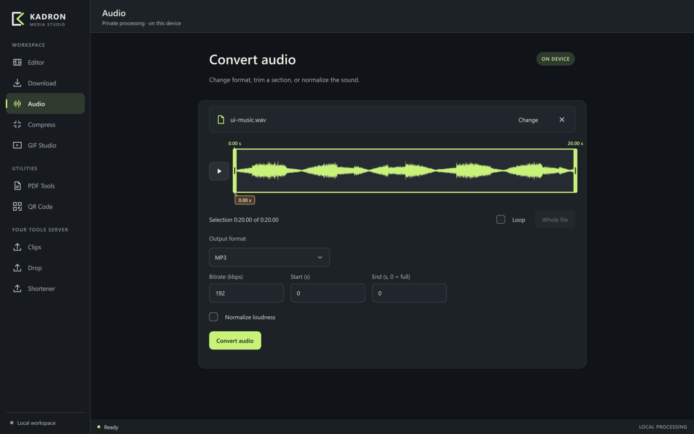
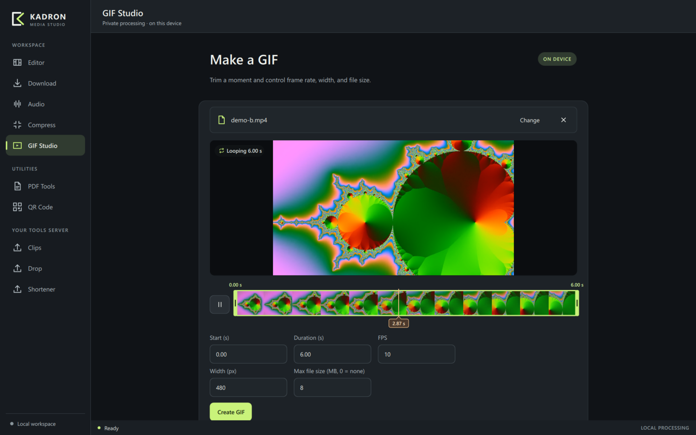
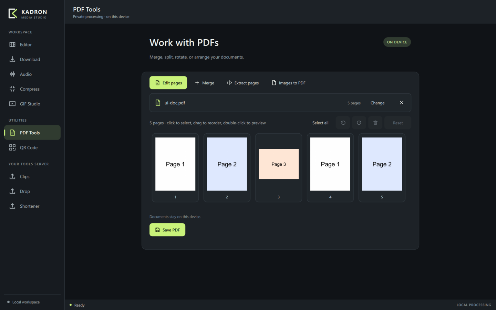
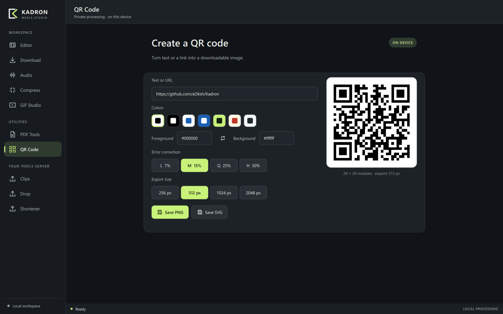

<p align="center">
  
</p>

<h1 align="center">Kadron</h1>

<p align="center">
  A desktop media studio that keeps your files on your computer.<br>
  Cut a sequence, trim audio, make GIFs, download, compress, and edit PDFs locally.
</p>

<p align="center">
  
</p>

## What it does

**Editor.** Build an ordered sequence of video and audio clips. Every clip sits on the timeline as a block with its filmstrip and waveform:

- Drag a block's edge to trim it; the monitor previews the new frame, and the cut stays reversible until you release.
- Drag blocks to reorder them, split at the playhead, and undo or redo any edit.
- Scrubbing lands on the exact frame, and playback runs across the whole sequence.
- Export the sequence as MP4 on the GPU (NVIDIA NVENC, Intel Quick Sync or AMD AMF, whichever works on your machine) or on the CPU. If the GPU encoder fails mid-export, Kadron finishes on the CPU. Projects are saved as `.kadr` files.
- Preview volume is shared by the editor and the tools, and remembered.

**Appearance.** Dark, light, or follow Windows, with an accent color of your choice. Open it from the palette button at the bottom of the sidebar. The same panel turns the startup intro on or off.

**Tools that run on your device:**

| Tool | What you get |
| --- | --- |
| Audio | Trim on the waveform, play the selection, then convert to MP3, WAV, FLAC or Opus, with optional loudness normalization |
| GIF Studio | Choose a range on a filmstrip with a looping preview; set frame rate, width, and a size limit |
| Compress | Shrink video or images, optionally to a target file size |
| Download | Paste a link and get a preview (thumbnail, title, length) before downloading with yt-dlp; Kadron keeps its own copy of yt-dlp up to date |
| PDF Tools | Edit pages visually (reorder, rotate, delete, preview); merge PDFs as cards showing each first page, in the order you drag them; pick pages to extract on thumbnails; turn images into a PDF |
| QR Code | Preview updates as you type; choose colors and error correction, then save PNG or SVG |

Nothing leaves your machine unless you ask it to. **Clips**, **Drop**, and **Shortener** are the only features that upload anything, and they send it to a self-hosted [Tools](https://github.com/al3ksh/Tools) server you connect in the app. Tools is the web version that runs at [tools.aleksh.xyz](https://tools.aleksh.xyz).

<table>
  <tr>
    <td></td>
    <td></td>
  </tr>
  <tr>
    <td></td>
    <td></td>
  </tr>
</table>

## Download

Get the Windows installer or the portable zip from [Releases](https://github.com/al3ksh/Kadron/releases/latest). Both include FFmpeg and the other tools Kadron uses, so there's nothing else to install. The installer needs no administrator rights, and Kadron updates itself from new releases.

## Status

Kadron is in active development. So far it has only been built and tested on Windows.

## Building

To build from source, you need:

- CMake 3.24+ and Ninja
- A C++20 compiler
- Qt 6.8+ with Quick, QuickControls2, Multimedia, Network, Concurrent and Test

Kadron also runs these external tools:

| Tool | Used for |
| --- | --- |
| FFmpeg and FFprobe | Thumbnails, waveforms, export, conversion, GIF |
| yt-dlp | Download |
| qpdf | PDF page operations |
| poppler (`pdftoppm`) | PDF page previews |
| qrencode | QR codes |

On Windows, MSYS2 UCRT64 provides all of them:

```bash
pacman -S mingw-w64-ucrt-x86_64-{qt6-base,qt6-declarative,qt6-multimedia,qt6-shadertools,ffmpeg,qpdf,poppler,qrencode,yt-dlp,cmake,ninja,gcc}
```

Then build and test:

```bash
cmake -S . -B build -G Ninja -DCMAKE_PREFIX_PATH=C:/msys64/ucrt64 -DCMAKE_BUILD_TYPE=Debug
cmake --build build -j 8
ctest --test-dir build --output-on-failure
```

Run `build/kadron.exe` with `C:\msys64\ucrt64\bin` on `PATH`. You can pass a media file or a `.kadr` project as the first argument. `KADRON_FFMPEG`, `KADRON_FFPROBE`, `KADRON_PDFTOPPM` (and similar variables) point Kadron at specific executables.

`packaging/windows/package.sh` builds the installer and portable zip into `dist/`. [BUILDING.md](BUILDING.md) has more detail on both.

## Project layout

```
src/      C++ core: project model, export, local tools, server clients
qml/      Interface (the Kadron QML module); Theme.qml holds every color, size and motion constant
tests/    Core tests (real FFmpeg/qpdf runs, local HTTP fixtures) and UI interaction tests
assets/   Logo and Windows icon
packaging/windows/  Installer script (NSIS) and the packaging build
```

The interface rules are in [DESIGN.md](DESIGN.md), and scope and constraints are in [PRODUCT.md](PRODUCT.md).

## License

Kadron is free software under the [GNU General Public License v3.0](LICENSE). Copyright © 2026 Aleks Szotek.
