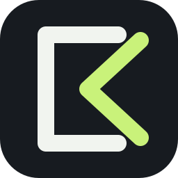
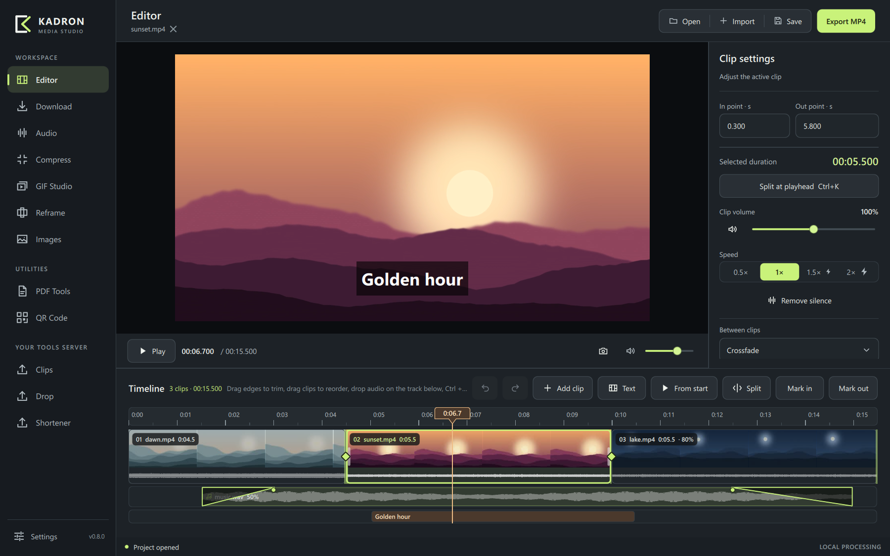
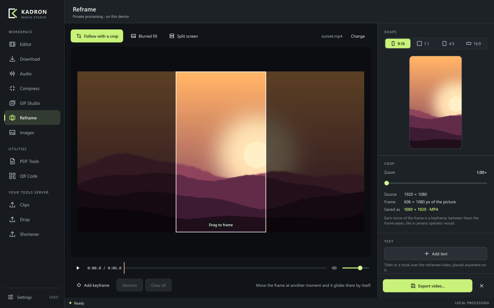
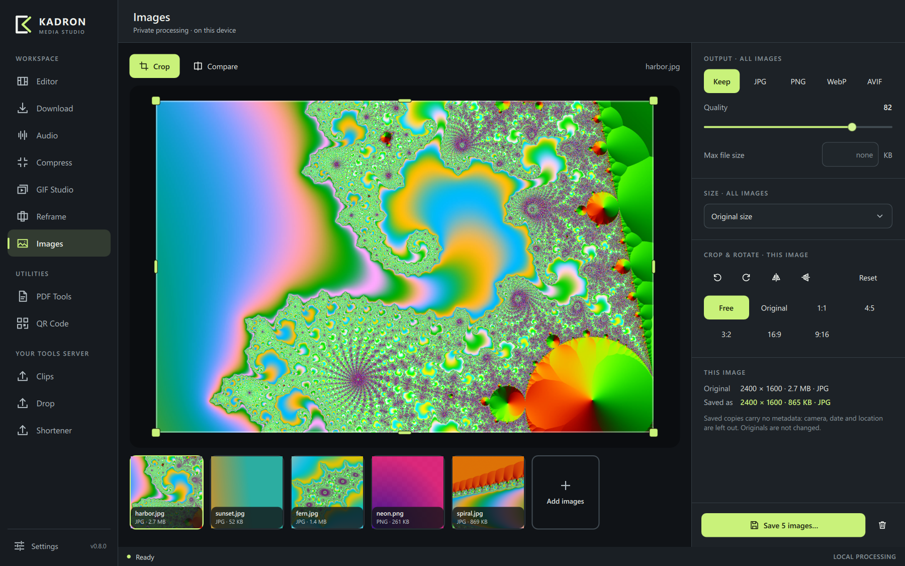
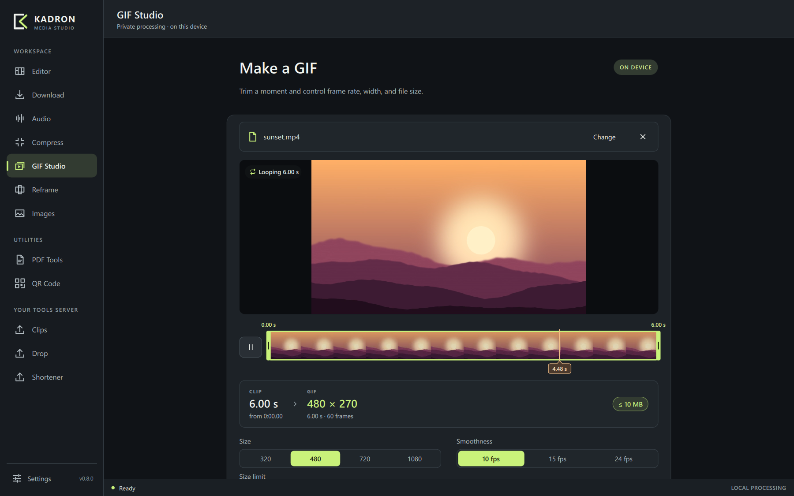
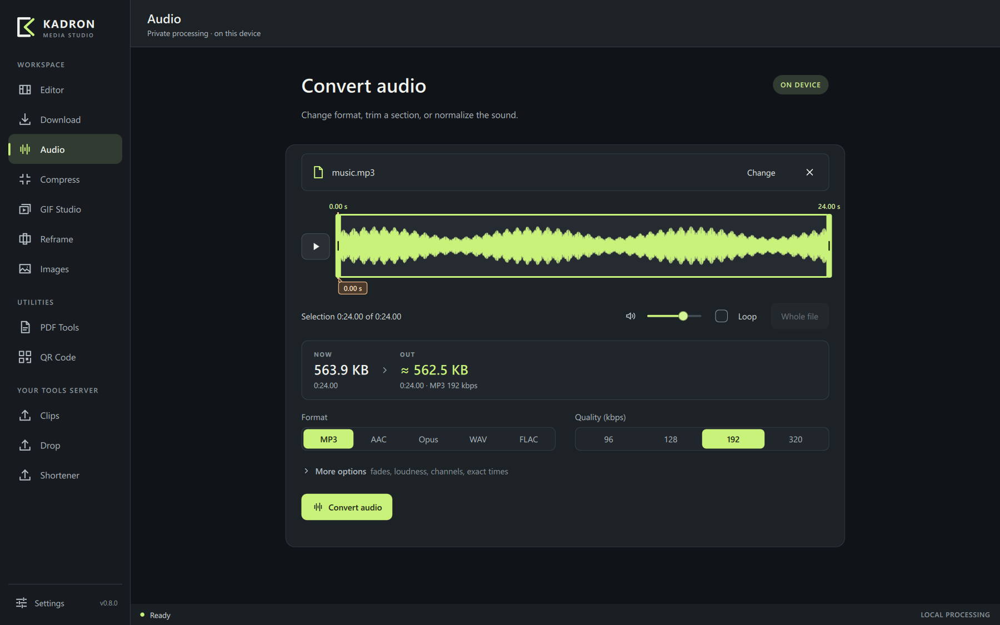
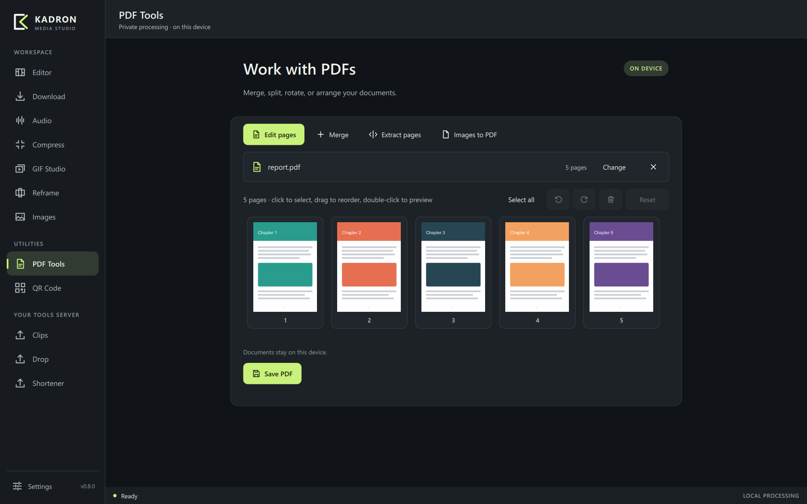
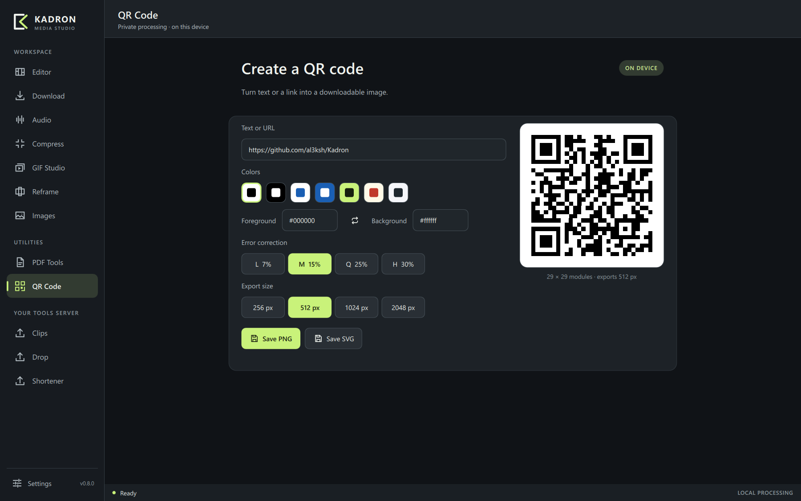

<p align="center">
  
</p>

<h1 align="center">Kadron</h1>

<p align="center">
  A desktop media studio that keeps your files on your computer.<br>
  Cut a sequence, trim audio, make GIFs, download, compress, and edit PDFs locally.
</p>

<p align="center">
  
</p>

## What it does

**Editor.** Build an ordered sequence of video and audio clips. Every clip sits on the timeline as a block with its filmstrip and waveform:

- Drag a block's edge to trim it; the monitor previews the new frame, and the cut stays reversible until you release.
- Drag blocks to reorder them, split at the playhead, and undo or redo any edit.
- Scrubbing lands on the exact frame, and playback runs across the whole sequence.
- Set each clip's volume (up to 200%) or mute it, play it at 0.5× to 2×, and let clips meet with a cut, a fade through black or a crossfade.
- **Remove silence** cuts the quiet stretches out of a clip in one step.
- Put text over the video: drag a caption where it should sit, stretch it on its own track for as long as it shows, and pick a font and an outline, box or shadow.
- The camera button under the monitor (or `Ctrl+Shift+S`) saves the current frame as an image.
- Lay music and sounds on the audio track under the clips: drop in as many files as you like, drag each to where it should play (it snaps to joins, the playhead and other sounds), trim its edges and drag its corners to fade it in and out. Each has its own volume, the track can duck under the clips' own sound, and anything still playing at the end fades out.
- Export the sequence as MP4 on the GPU (NVIDIA NVENC, Intel Quick Sync or AMD AMF, whichever works on your machine) or on the CPU. If the GPU encoder fails mid-export, Kadron finishes on the CPU. Projects are saved as `.kadr` files.
- Preview volume is shared by the editor and the tools, and remembered.
- If Kadron closes unexpectedly, unsaved work (copied aside a minute after each edit) is offered back at the next start.

**Appearance.** Dark, light, or follow Windows, with an accent color of your choice. Open it from the palette button at the bottom of the sidebar. The same panel turns the startup intro on or off.

**Explorer menu.** Right-click a video, audio file, image or PDF and pick **Kadron** (on Windows 11 it sits under *Show more options*) to open it straight in the right tool: edit, reframe for vertical, compress, make a GIF, extract audio, resize images, combine images into a PDF or open PDF Tools. Select several files and they arrive together in one Kadron window. The installer adds the menu for your user only; turn it off or back on in the Appearance panel.

**Close project.** `Ctrl+W` or the ✕ next to the project name closes it and releases its media, so you can move or delete the source files while Kadron stays open.

**Tools that run on your device:**

| Tool | What you get |
| --- | --- |
| Audio | Trim on the waveform, play the selection, then convert to MP3, AAC, Opus, WAV or FLAC at a chosen bitrate, with the output size estimated before you start. Under *More options*: fade in and out, a loudness target (Podcast, Music, Loud), mono, and exact start and end times |
| GIF Studio | Choose a range on a filmstrip with a looping preview; pick the size, smoothness and a file size limit while a meter shows the clip and the GIF it becomes. Under *More options*: speed, bounce (forward then back) and play once |
| Compress | Shrink video or images, optionally to a target file size |
| Reframe | Turn a landscape video into 9:16, 1:1, 4:5 or 16:9. Either a crop that follows the action (move the frame at different moments and it eases between those keyframes, with a live preview of the result) the whole picture over a blurred copy of itself, or a split screen that stacks two regions, such as a streamer's webcam (any size and place) above the game. Exports 1080p MP4 |
| Images | Convert a batch of photos between JPG, PNG, WebP and AVIF (HEIC in), resize them, fit them under a file size, crop with aspect presets, rotate and flip; compare before and after. Shows the camera, date and GPS location a photo carries; saved copies have no metadata |
| Download | Paste a link and get a preview (thumbnail, title, length) before downloading with yt-dlp; Kadron keeps its own copy of yt-dlp up to date |
| PDF Tools | Edit pages visually (reorder, rotate, delete, preview); merge PDFs as cards showing each first page, in the order you drag them; pick pages to extract on thumbnails; turn images into a PDF |
| QR Code | Preview updates as you type; choose colors and error correction, then save PNG or SVG |

Nothing leaves your machine unless you ask it to. **Clips**, **Drop**, and **Shortener** are the only features that upload anything, and they send it to a self-hosted [Tools](https://github.com/al3ksh/Tools) server you connect in the app. Tools is the web version that runs at [tools.aleksh.xyz](https://tools.aleksh.xyz).

<table>
  <tr>
    <td></td>
    <td></td>
  </tr>
  <tr>
    <td></td>
    <td></td>
  </tr>
  <tr>
    <td></td>
    <td></td>
  </tr>
</table>

## Download

Get the Windows installer or the portable zip from [Releases](https://github.com/al3ksh/Kadron/releases/latest). Both include FFmpeg and the other tools Kadron uses, so there's nothing else to install. The installer needs no administrator rights, and Kadron updates itself from new releases.

## Status

Kadron is in active development. So far it has only been built and tested on Windows.

## Building

To build from source, you need:

- CMake 3.24+ and Ninja
- A C++20 compiler
- Qt 6.8+ with Quick, QuickControls2, Multimedia, Network, Concurrent and Test

Kadron also runs these external tools:

| Tool | Used for |
| --- | --- |
| FFmpeg and FFprobe | Thumbnails, waveforms, export, conversion, GIF |
| yt-dlp | Download |
| qpdf | PDF page operations |
| poppler (`pdftoppm`) | PDF page previews |
| qrencode | QR codes |

On Windows, MSYS2 UCRT64 provides all of them:

```bash
pacman -S mingw-w64-ucrt-x86_64-{qt6-base,qt6-declarative,qt6-multimedia,qt6-shadertools,ffmpeg,qpdf,poppler,qrencode,yt-dlp,cmake,ninja,gcc}
```

Then build and test:

```bash
cmake -S . -B build -G Ninja -DCMAKE_PREFIX_PATH=C:/msys64/ucrt64 -DCMAKE_BUILD_TYPE=Debug
cmake --build build -j 8
ctest --test-dir build --output-on-failure
```

Run `build/kadron.exe` with `C:\msys64\ucrt64\bin` on `PATH`. You can pass a media file or a `.kadr` project as the first argument, or `--tool=<edit|reframe|compress|gif|audio|images|images-to-pdf|pdf>` followed by files. `--register-shell` and `--unregister-shell` add or remove the Explorer menu for the current user. `KADRON_FFMPEG`, `KADRON_FFPROBE`, `KADRON_PDFTOPPM` (and similar variables) point Kadron at specific executables.

`packaging/windows/package.sh` builds the installer and portable zip into `dist/`. [BUILDING.md](BUILDING.md) has more detail on both.

## Project layout

```
src/      C++ core: project model, export, local tools, server clients
qml/      Interface (the Kadron QML module); Theme.qml holds every color, size and motion constant
tests/    Core tests (real FFmpeg/qpdf runs, local HTTP fixtures) and UI interaction tests
assets/   Logo and Windows icon
packaging/windows/  Installer script (NSIS) and the packaging build
```

The interface rules are in [DESIGN.md](DESIGN.md), and scope and constraints are in [PRODUCT.md](PRODUCT.md).

## License

Kadron is free software under the [GNU General Public License v3.0](LICENSE). Copyright © 2026 Aleks Szotek.
